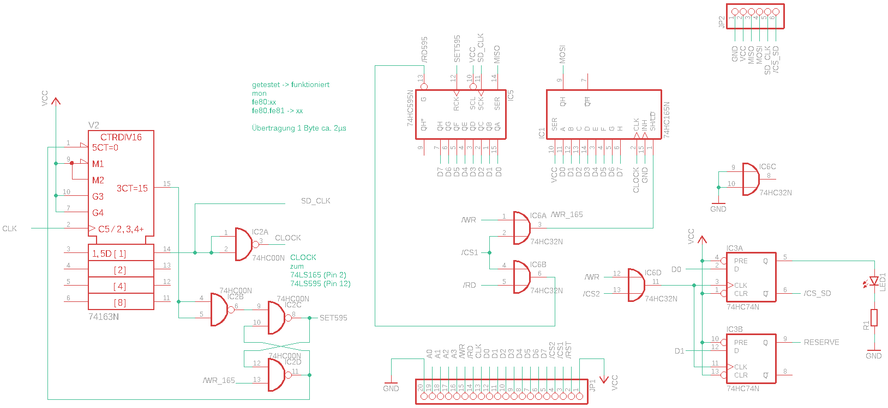
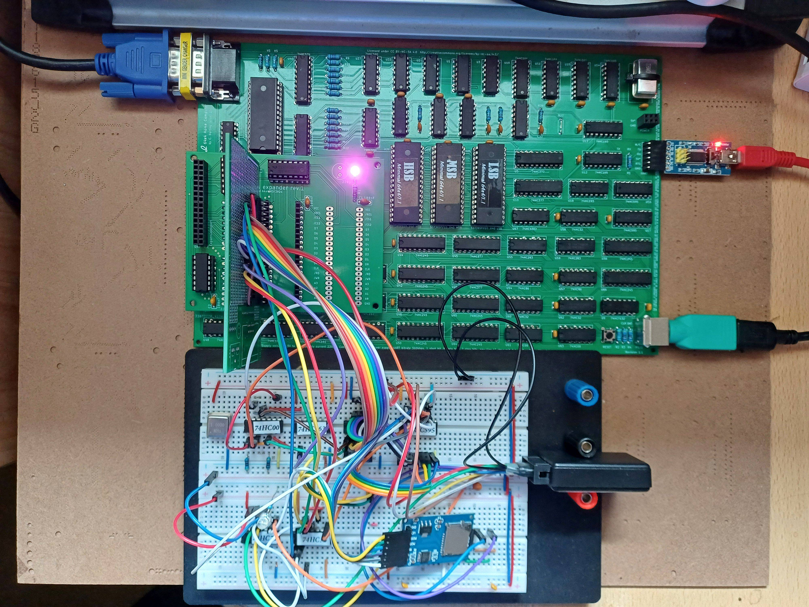

# SPI for the minimal 64x4

My first attempt to operate an SD card at a Minimal 64x4. With the following circuit I found a stable, functioning hardware.

Currently I am waiting for the first PCB to make testing easier.
I have also already tested the software for basic communication with the SD card.
Reading and writing individual sectors on the SD card is possible.
Now I will try to write a FAT32 library. But that is still a long way off.

