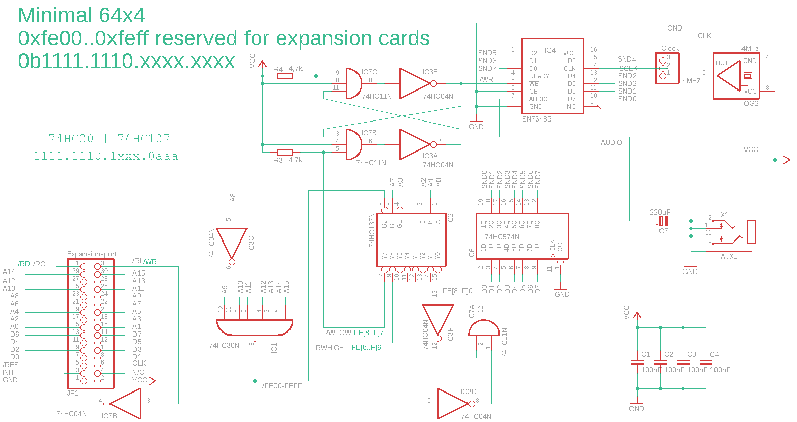

# SN76489 on the Minimal 64x4

My first test setup for an SN76489 sound chip on the minimal.

## Schaltung

## A simple Player

https://github.com/hans61/Minimal-64x4/tree/main/hardware/SN76489/player

## A sound example

https://github.com/hans61/Minimal-64x4/tree/main/hardware/SN76489/examples

I tried to include it:

