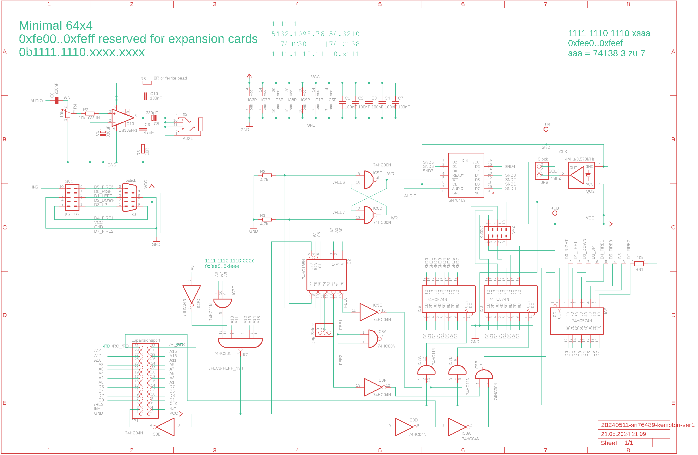
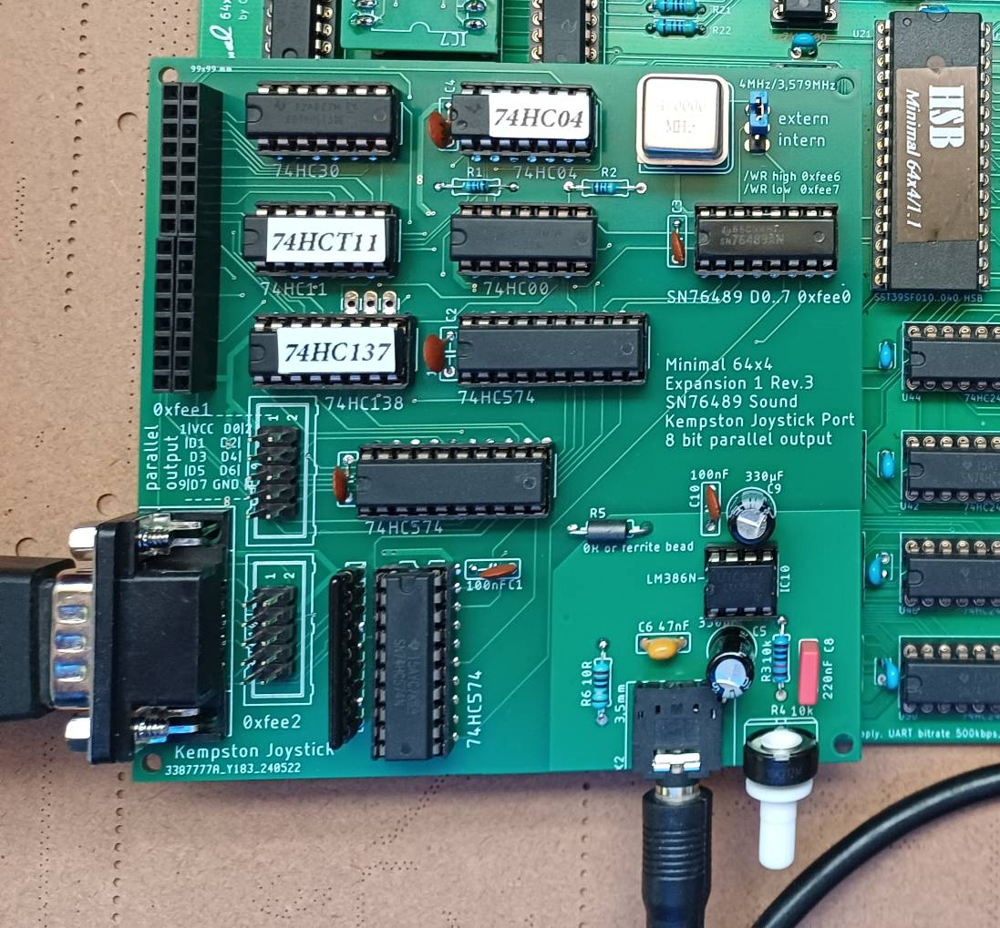
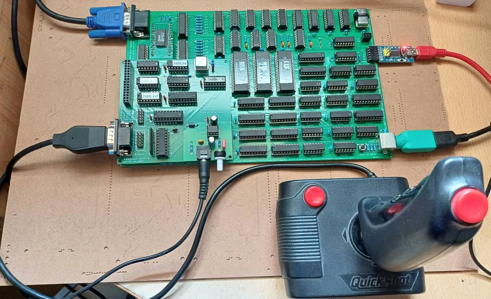

# SN76489 on the Minimal 64x4

My second expansion board for an SN76489 sound chip on the minimal.
I tried to improve the analog part of the sound output.
The board now also has a joystick connection for a Kempston compatible joystick (Atari-2600, ZX Spectrum,...).
There is also a freely available output port.

## Schaltung

The board uses the following I/O addresses

| address | comment              |
|---------|----------------------|
| 0xfee0  | Out1 = SN76489 D0..7 |
| 0xfee1  | Out2                 |
| 0xfee2  | Joystick             |
| 0xfee6  | SN76489 /WE high     |
| 0xfee7  | SN76489 /WE low      |

## A simple Player

https://github.com/hans61/Minimal-64x4/tree/main/hardware/SN76489/player

A simple player for testing. It plays VGM files in a special format.
I created them using the vgm-converter from this project:

https://github.com/simondotm/vgm-converter

The vgm file must be loaded/saved at address 0x8000.

## A sound example

https://github.com/hans61/Minimal-64x4/tree/main/hardware/SN76489/examples

The original file is ChrisKelly.vgm, the vgm converter became ChrisKelly.bin.
ChrisKelly.hex is the file for the minimal 64x4, which is loaded to 0x8000.

I made a very simple video of it:

https://youtu.be/yanbZCrXf6M

