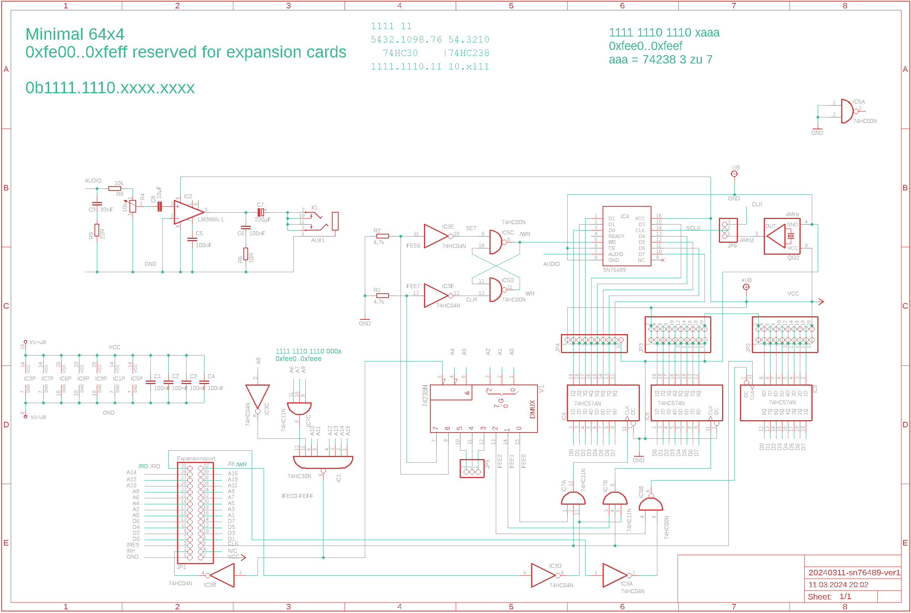
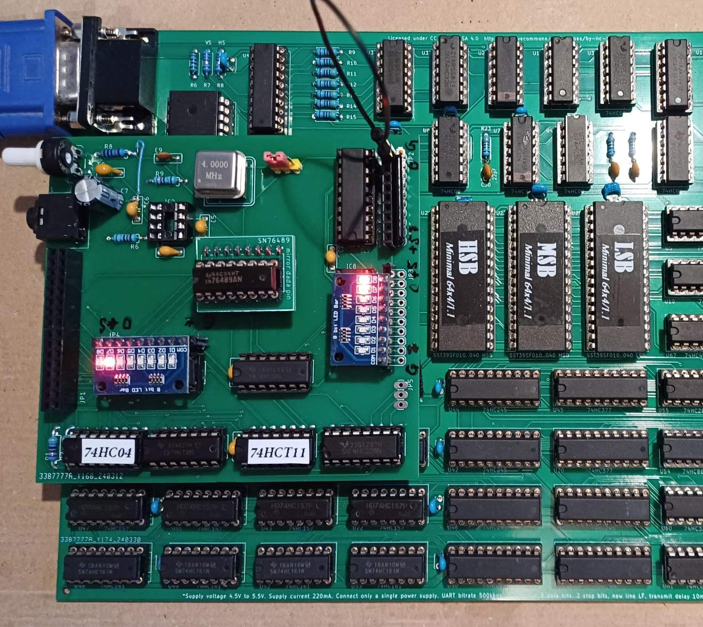

# SN76489 on the Minimal 64x4

My first test setup for an SN76489 sound chip on the minimal.

## Schaltung

My first test board, it still has errors. The pin assignment of the SN76489 is incorrect.
I corrected it with a small adapter.
I don't like the audio amplifier either. I have problems with noise interference.
I have achieved the best results so far by directly decoupling the audio output from the SN76489 with a capacitor.
I will make some more changes.

The board uses the following I/O addresses

0xfee0 -> Out1 = SN76489 D0..7
0xfee1 -> Out2
0xfee2 -> In
0xfee6 -> SN76489 /WE high
0xfee7 -> SN76489 /WE low

## A simple Player

https://github.com/hans61/Minimal-64x4/tree/main/hardware/SN76489/player

A simple player for testing. It plays VGM files in a special format.
I created them using the vgm-converter from this project:

https://github.com/simondotm/vgm-converter

The vgm file must be loaded/saved at address 0x8000.

## A sound example

https://github.com/hans61/Minimal-64x4/tree/main/hardware/SN76489/examples

The original file is ChrisKelly.vgm, the vgm converter became ChrisKelly.bin.
ChrisKelly.hex is the file for the minimal 64x4, which is loaded to 0x8000.
