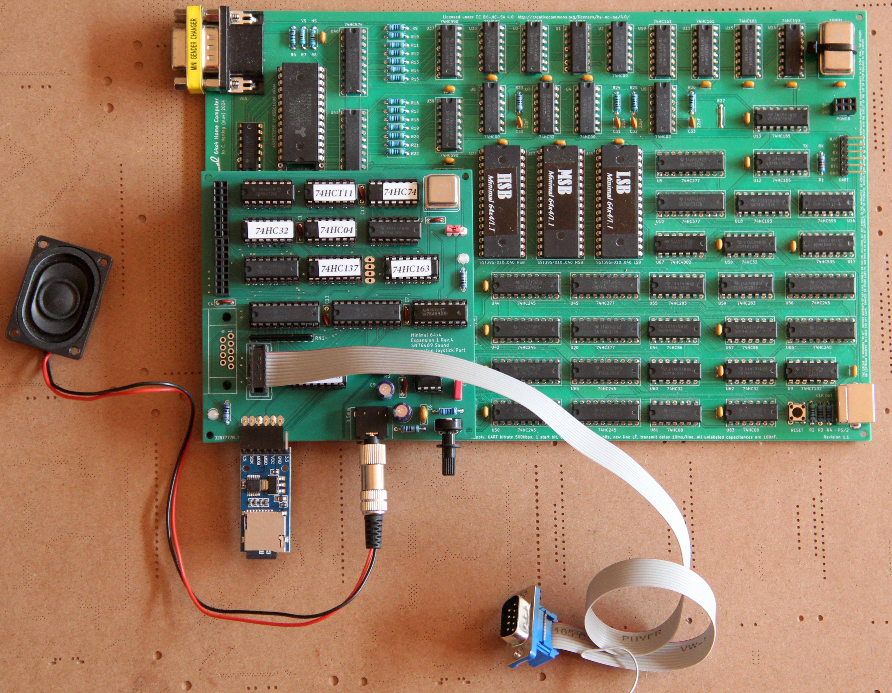
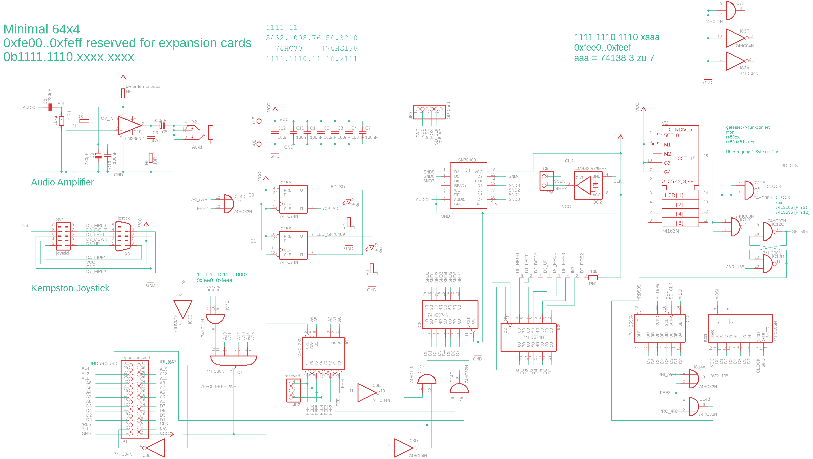

# Extensions Compact for the minimal 64x4
# This version is outdated!!! I will publish the current one in the next days

- Kempston Joytick Interface with 74HC574
- Sound with SN76489
- SD Card with 74HC165/74HC595

The current software for this extension

https://github.com/hans61/Minimal-64x4/tree/main/hardware/expansion-compact/software

## Schematic

